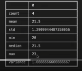
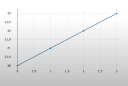

# Hello_DanfoJS

해당 프로젝트는 <a href="https://www.youtube.com/user/egoing2">생활코딩</a> 님의 프로젝트를 간단히 요약한 것 임을 밝힙니다.


Danfo JS 란 우리가 필요한 데이터 정보들을 시각화 하여 보여주고 관리하게 해주며 파일 읽기 및 데이터 생성 관련 함수를 사용하여 데이터의 삽입 삭제가 자유롭고 도출된 데이터를 다시 JSON 의 형식으로 파싱하게 도와준다.

## DanfoJS 설치

```javascript
yarn add danfojs-node
// danfojs 설치
```

## 데이터 조회

```javascript
var s = new dfd.Series([20,21,22,23])
// 데이터로 20 21 22 23 의 값을 가진 테이블을 만듦
s.print()
//데이터를 화면에 출력
```


```javascript
s.describe().print()
// 통계정보를 화면에 출력함 (중앙값 , 평균 등)
```



```javascript
s.plot('태그의 id값').table()
// 테이블을 해당 div 태그에 삽입하여 시각화해줌
```


```javascript
s.plot('태그의 id값').line()
// 선 분포도를 시각화하여 해당 div 태그로 시각화해줌
```



## 데이터 생성

```javascript
// 배열방식
var d1 = new dfd.DataFrame([
  {'속성명' : 값 , '속성명' : 값},
  {...}
])
// 객체방식
var d2 = new dfd.DataFrame({
  '속성명' : [값,값,값],
  ...
})

// 파일방식
dfd.read_csv('파일주소')
  .then(data => data.print())
```

## 특정 컬럼 조회

```javascript
d1.loc({columns:['원하는','속성들']}).print()
```

## 특정 로우 조회

```javascript
d1.loc({rows:[1,3]}).print()
// 첫 번째 세 번째 rows 를 출력함

d1.loc({columns:['원하는','속성들'] , rows:[1,3]}).print()
// 이렇게 하이브리드로 조회도 가능함
```

## 논리비교

```javascript
d1
  .query({'column OR row' : '컬럼명 OR 행 id' , 'is' : '논리비교 연산자' , 'to' : 조건})
  .print
// 로 조건식도 가능하다
// 예시
d1
   .query({ "column": "온도", "is": ">", "to": 20 })
   .query({ "column": "판매량", "is": "<", "to": 46 })
   .print();
```

## 데이터 추가

```javascript
행 추가
     var newRow = new dfd.DataFrame({'온도':[24,25], '요일':['월','월'], '판매량':[48,50]});
     // 온도 열에 24 와 25 행  , 요일 열에 월 월 데이터  , 판매량 에 48 50 을 추가한다.
     d1.append(newRow).print();
     // 해당 새 데이터 테이블을 d1 테이블에 적용하고 출력
열 추가
     d1.addColumn({ "column": "비", "value": [1,0,1,0]});
     // 속성명이 '비' 인 데이터 1 , 0 , 1, 0 을 갖고있는 열을 추가
     d1.print();
     출력한다.
```

## 데이터 삭제

```javascript
행삭제
      d1.drop({axis:0, index:[0]}).print();
      // axis 0 은 행을 나타냄 0 번째 행을 삭제하고 출력
열삭제
      d1.drop({axis:1, columns:['온도']}).print();
      // axis 1 은 열을 나타냄
// to Array
d1.to_json().then(function(json){
 console.log(JSON.parse(json))
});
      
```

